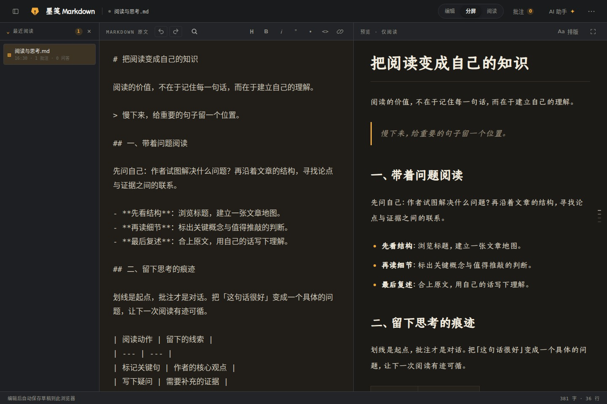
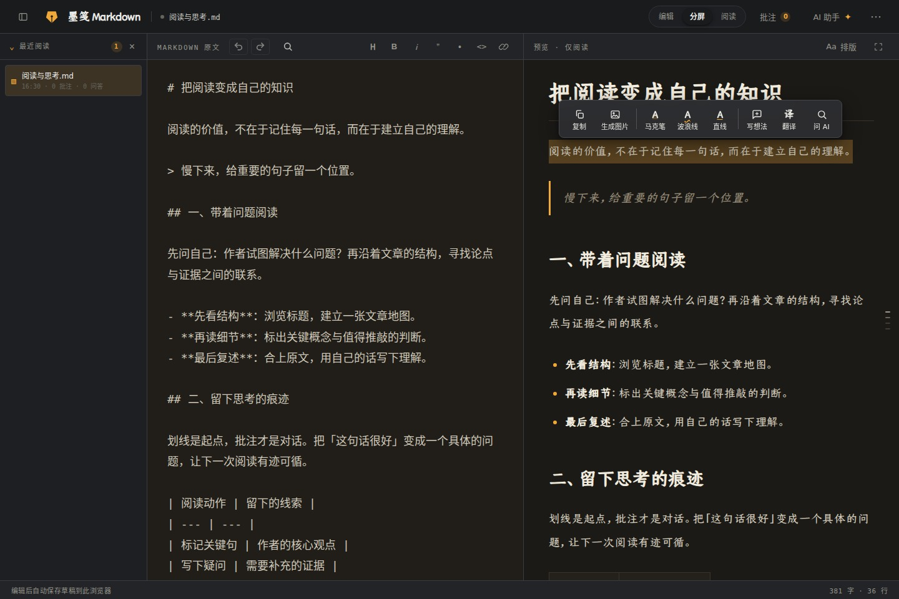
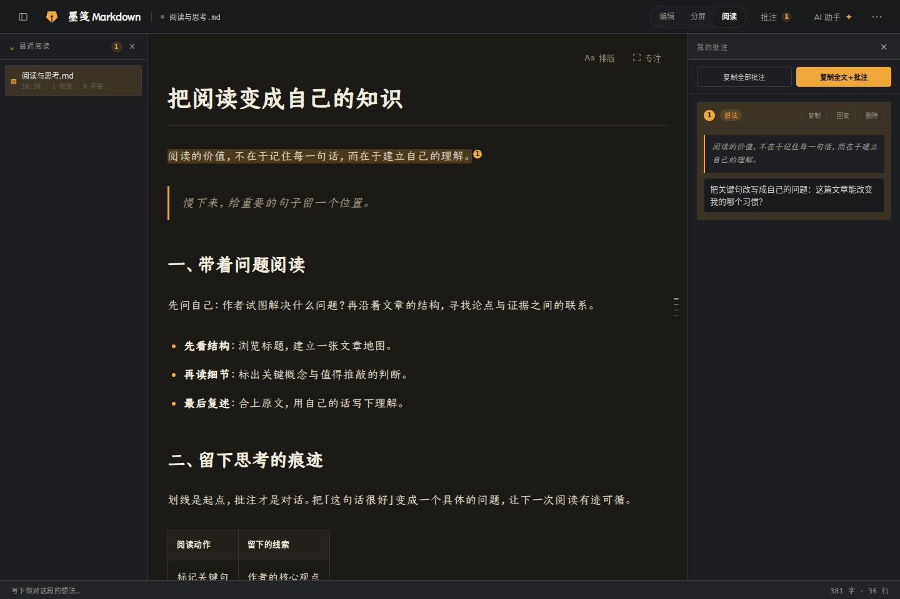
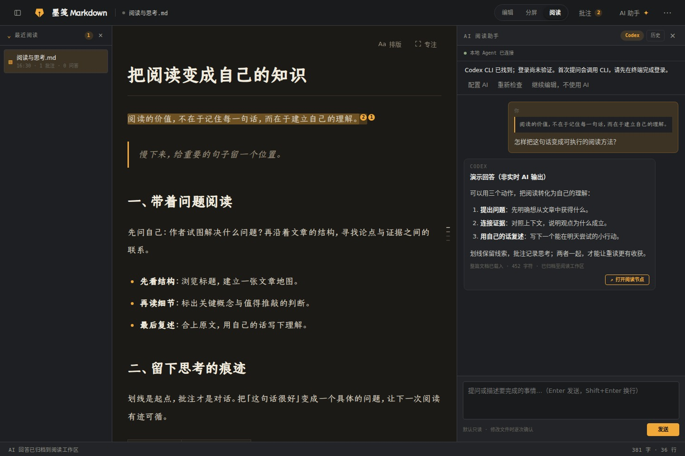

# Mojian Markdown

[简体中文](./README.md) | **English**

A source-available Markdown editor for reading, learning, and annotation: edit directly, preview live, jump between source and preview, highlight and annotate, export long images, cache locally, and import or export documents. Connect the optional local Agent Bridge for AI Q&A and a recent-reading list.

The interface uses the Mojian design system's dark “Ink” theme: warm brown-black tones, a single amber accent, and a Kai-style Chinese reading font.

**[Try Mojian Markdown online →](https://yuxizhai.com/md-editor/)**



The left pane contains the Markdown source; the right pane is a read-only reading view. Recent reading, the document outline, annotations, and AI Q&A are organized around the current document.

These screenshots show the actual application rendered in a browser at a consistent 1440 × 960 viewport. They use the Chinese interface and original Chinese sample text and annotations. The AI answer and channel-readiness status are demo fixtures, not evidence of live model output or a working AI account. The answer is explicitly labeled as a demo in the screenshot. See the [screenshot notes](./docs/screenshots/README.md) (in Chinese) for provenance and regeneration instructions.

## Ways to run

| Edition | Build / start | Capabilities |
| --- | --- | --- |
| Online demo | [Try it now](https://yuxizhai.com/md-editor/) / `npm run build` | Editing, preview, annotations, local caching, import, and export. Pure static files that can be deployed to any static host. |
| Full local version | `npm run dev` / `npm run build:bridge` | Everything in the static version, plus recent reading and AI Q&A through a local Agent Bridge and a compatible AI setup. See [AI assistant requirements](#ai-assistant-requirements). |
| Desktop (Electron) | `npm run desktop` / `npm run build:desktop` | Everything in the full local version, plus an embedded Agent Bridge, native file dialogs and real file paths, and opening `.md` files by double-clicking. |

Build mode controls feature availability (`--mode bridge` or the `VITE_ENABLE_AGENT_BRIDGE=true` environment variable); all editions share the same codebase.

## Quick start

```bash
npm install
npm run dev
```

The terminal prints the local URL, usually `http://localhost:5173/`. `npm run dev` starts both the frontend and the local Agent Bridge. You can also start them separately:

```bash
npm run dev:web     # Frontend only
npm run dev:bridge  # Local Agent Bridge only
```

## Desktop (Electron)

```bash
npm run desktop        # Build the frontend and start the desktop app
npm run build:desktop  # Build installers into release/
npm run test:desktop   # Desktop smoke tests; run npm run build:bridge first
```

The desktop app adds capabilities beyond the browser version:

- **Agent Bridge embedded in the main process:** a random port and same-origin frontend hosting, without manually running `npm run dev` or exposing the fixed CORS-enabled port 4317.
- **Native file dialogs and real absolute paths:** file-access grants are persisted in the user-data directory, allowing bidirectional local-file synchronization to resume after a restart.
- **System integration:** double-click an `.md` file in Finder or use “Open With” to open it in the editor. Standard packaged builds include file associations.

The repository also has an isolated **TEST installer** pipeline for Windows x64 and macOS arm64/x64. These are test artifacts, not a production release. They have no file associations and are not Developer ID signed or notarized; macOS test bundles use a local ad-hoc signature. See [TEST installers](./docs/TEST_INSTALLERS.md) for packaging, smoke-test coverage, and remaining validation limits.

If the Electron binary download fails during initial installation, for example in a proxy environment, retry with the mirror:

```bash
ELECTRON_MIRROR=https://npmmirror.com/mirrors/electron/ node node_modules/electron/install.js
```

## Reading font (optional)

The Kai-style reading font is Canger Jinkai 04 (仓耳今楷 04). **The font is not distributed with this repository** and remains the property of its rights holder. Without it, the app falls back to system Kai fonts (`Kaiti SC` / `楷体`); the other features still work.

For the intended typography, run:

```bash
npm run font:fetch
```

The script downloads the font from the official WeRead CDN, verifies its SHA-256 checksum, and generates a WOFF2 subset covering the GB2312 character set in `public/fonts/` (about 2 MB, compared with the 16 MB original). Characters outside the subset fall back individually to system Kai fonts. See [`fonts-src/canger-jinkai-04/SOURCE.md`](./fonts-src/canger-jinkai-04/SOURCE.md) for the source and checksum, and comply with the font owner's license terms.

## AI assistant requirements

To use the Claude Code channel, install [Claude Code](https://claude.com/claude-code) locally and ensure that the `claude` command is available:

```bash
claude --version
```

You can set `AGENT_BRIDGE_CLAUDE_COMMAND` to another compatible command. Other configured AI channels have their own setup requirements. A missing or unavailable AI channel does not prevent editing, reading, or annotation. Detecting a local command does not verify that its account is signed in or that a model request will succeed.

## Core features

### Direct editing and live preview

Changes to Markdown in the left pane immediately update the right-hand preview. Use the preview for reading, highlighting, and annotation; make text changes in the source editor.

### Jump between source and preview

Double-click in the Markdown source to jump to the corresponding position in the preview. Double-click in the preview to jump back to the source.

### Highlights and annotations

Select text in the preview to add a marker highlight, wavy underline, straight underline, or note. They are collected in the “My annotations” panel (`我的批注` in the screenshots). In the static version, annotations are saved with the current article in the browser's `localStorage`.





### Immersive reading and paper themes

Immersive reading hides the editing area and side lists so you can focus on the document. Choose standard or wide reading width, adjust the font size, and switch between five paper themes: Ink Black, Parchment, Cream, Clean White, and Soft Green.

| Parchment | Soft Green |
| --- | --- |
|  |  |

### Export a long image

Choose “More actions → Export long image” (`更多操作 → 导出长图`) in the top bar to render the current preview as a shareable PNG. Layout, reading font, paper color, and highlights match the preview. The first level-one heading becomes a poster title, and the footer includes the filename and date.

Choose mobile or standard width, and optionally hide highlights to export just the document. The image has no scrollbars; tables and code blocks wrap instead of being cropped. For very long documents, the renderer lowers the scale to fit canvas limits and renders tiles before stitching them together.

### AI Q&A (full local version)

Select text and choose “Ask AI” (`问 AI`). The AI uses the selected passage and the full document as context. Conversations are saved as child entries under the current document and can be reopened from the recent-reading list.



### Recent reading (full local version)

The local Agent Bridge maintains a list of documents and conversations synchronized to the Reading Workspace. The default data directory is `.reading-workspace/`. To use a different directory:

```bash
AGENT_BRIDGE_WORKSPACE=/path/to/reading npm run dev
```

## Browser extension: Mojian Web Clipper

The repository also includes a Chrome / Edge extension (Manifest V3). It converts a web page's main article, full page, or selected content to Markdown, which you can preview, copy, or download as an `.md` file.

Its Mojian Reading page provides Markdown source on the left and a live preview on the right, with dark/light themes and font-size controls for a distraction-free reading experience.

```bash
npm run build:ext   # Build into dist-extension/, then load it unpacked at chrome://extensions
```

See [`extension/README.md`](./extension/README.md) (in Chinese).

## Development

```bash
npm run check       # Code-size limits, type checking, unit tests, and builds (including the extension)
npm test            # Unit tests using node:test
npm run test:e2e    # Playwright E2E tests; first run npx playwright install chromium
npm run check:full  # check plus E2E tests
```

See [`docs/CODING_GUIDELINES.md`](./docs/CODING_GUIDELINES.md) for coding conventions and [`docs/TESTING.md`](./docs/TESTING.md) for the test suite and test-first workflow. Read [`AGENTS.md`](./AGENTS.md) before working with a coding agent.

## Copyright and licensing

The software code is licensed under the [PolyForm Noncommercial License 1.0.0](./LICENSE). Noncommercial use, research, modification, and distribution are permitted under its terms; commercial use requires prior written authorization. Documentation, promotional materials, branding, and third-party materials are not automatically covered by the code license.

See [Copyright and commercial licensing](./LICENSING.md) (in Chinese) for the full scope, examples of commercial use, information about historical MIT-licensed versions, and contact details. The Canger Jinkai font is outside this repository's license; its use and redistribution are governed by the font owner's terms.
