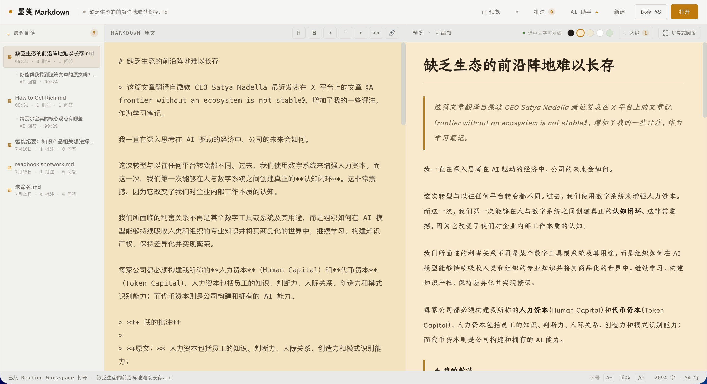
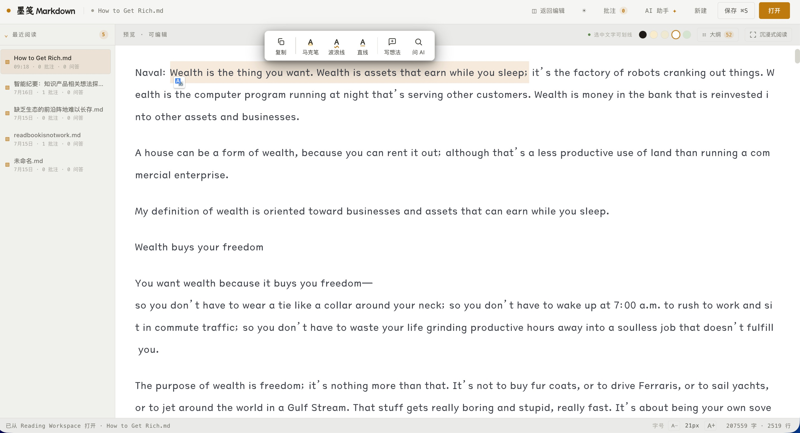
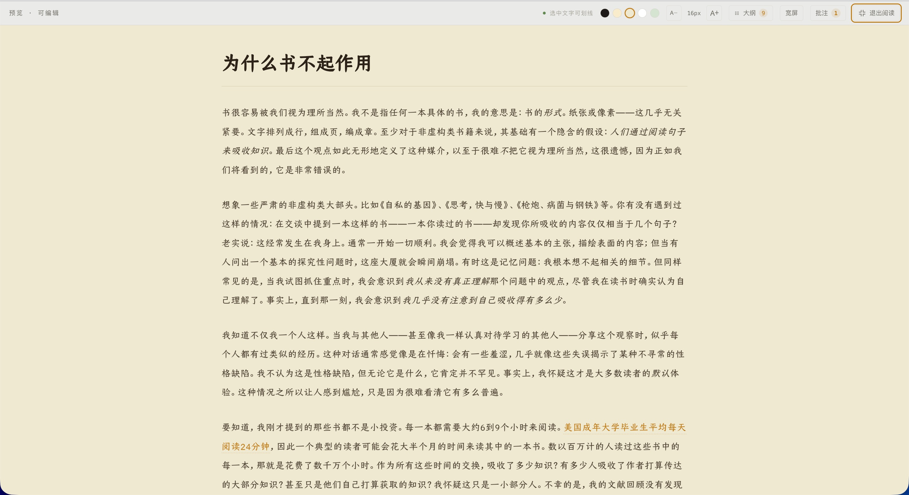
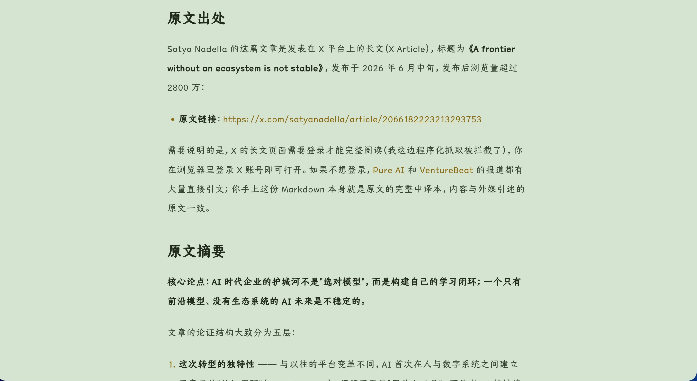
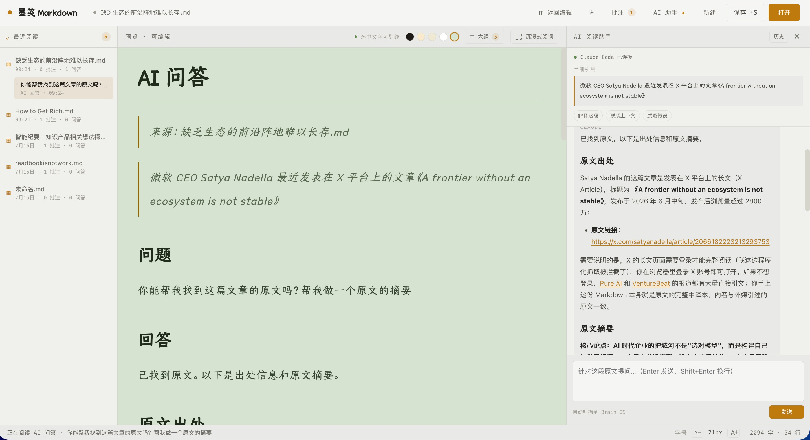

# 墨笺 Markdown

一个源码开放、面向阅读、学习和评注的 Markdown 编辑器：直接编辑、实时预览、双向定位、划线批注、本地缓存与导入导出。可选接入本地 Agent Bridge，获得 AI 问答和最近阅读列表。

界面采用墨笺（Mojian）设计系统的「墨」暗色主题：暖棕墨色 + 单一琥珀强调色 + 楷体阅读衬线。

**[在线体验墨笺 Markdown →](https://yuxizhai.com/md-editor/)**



左侧保留 Markdown 原文，右侧呈现可直接编辑的阅读视图；最近阅读、文章大纲、批注和 AI 问答都围绕当前文档组织。

## 两种形态

| 形态 | 构建/启动 | 能力 |
| --- | --- | --- |
| 线上体验版 | [立即体验](https://yuxizhai.com/md-editor/) / `npm run build` | 编辑、预览、批注、本地缓存、导入导出。纯静态文件，可部署到任意静态托管 |
| 完整版（本地） | `npm run dev` / `npm run build:bridge` | 静态版全部能力 + 最近阅读列表 + AI 问答（依赖本机 Agent Bridge 与 `claude` CLI） |
| 桌面端（Electron） | `npm run desktop` / `npm run build:desktop` | 完整版全部能力 + 内嵌 Agent Bridge（免手动启动）+ 原生文件对话框与真实路径 + 双击 `.md` 直接打开 |

功能开关由构建模式控制（`--mode bridge` 或环境变量 `VITE_ENABLE_AGENT_BRIDGE=true`），同一套代码。

## 快速开始

```bash
npm install
npm run dev
```

终端会输出本地访问地址（通常是 `http://localhost:5173/`）。`npm run dev` 会同时启动前端和本地 Agent Bridge；也可以分开：

```bash
npm run dev:web     # 只启动前端
npm run dev:bridge  # 只启动本地 Agent Bridge
```

## 桌面端（Electron）

```bash
npm run desktop        # 构建前端并启动桌面应用
npm run build:desktop  # 打包安装包（输出到 release/）
npm run test:desktop   # 桌面端冒烟测试（需先 npm run build:bridge）
```

桌面端解决的是网页版做不到的部分：

- **Agent Bridge 内嵌到主进程**——随机端口、同源托管前端，无需手动 `npm run dev`，也不再暴露带 CORS 的固定 4317 端口；
- **原生文件对话框与真实绝对路径**——授权一次永久有效（授权清单持久化在用户数据目录），重启后本地文件双向同步自动恢复；
- **系统集成**——在 Finder 中双击 `.md` / 「打开方式」直接进入编辑器（打包版含文件关联）。

首次安装如 Electron 二进制下载失败（常见于网络代理环境），执行：

```bash
ELECTRON_MIRROR=https://npmmirror.com/mirrors/electron/ node node_modules/electron/install.js
```

## 阅读字体（可选）

界面的楷体阅读字体是仓耳今楷 04。**字体不随仓库分发**（版权归字体所有者），不获取字体时会自动回退到系统楷体（Kaiti SC / 楷体），功能不受影响。

想要完整视觉效果，运行：

```bash
npm run font:fetch
```

脚本会从微信读书官方 CDN 下载字体、做 SHA-256 校验，并自动裁剪出 GB2312 字符集的 woff2 子集（约 2MB，原字体 16MB）放入 `public/fonts/`。生僻字由系统楷体逐字兜底。字体来源与校验信息见 `fonts-src/canger-jinkai-04/SOURCE.md`；使用请遵守字体所有者的许可条款。

## AI 助手依赖

AI 问答依赖本机安装有 [Claude Code](https://claude.com/claude-code) 的 `claude` 命令：

```bash
claude --version
```

也可以通过 `AGENT_BRIDGE_CLAUDE_COMMAND` 环境变量指定其他兼容命令。没有可用命令时，AI 助手不可用，其余功能不受影响。

## 核心能力

### 直接编辑，实时生效

编辑 Markdown 后右侧预览实时更新；预览区域也支持直接编辑并同步回原文，接近所见即所得。

### 双向定位

在 Markdown 原文双击定位到预览对应位置；在预览双击定位回原文。

### 划线批注

在预览中选中文字，可添加马克笔、波浪线、直线或想法批注，集中展示在「我的批注」面板。静态版的批注随当前文章保存在浏览器 `localStorage`。




### 沉浸式阅读与纸张主题

进入沉浸式阅读后，可以隐藏编辑区域与侧边列表，只保留文章内容；支持标准 / 宽屏阅读、字号调整，以及墨黑、羊皮纸、米黄、清爽白、豆沙绿五种纸张主题。

| 羊皮纸 | 豆沙绿 |
| --- | --- |
|  |  |

### AI 问答（完整版）

选中文字后「问 AI」，AI 结合选中原文和整篇文档回答。问答记录保存为当前文档的子节点，可在最近阅读列表中重新打开。



### 最近阅读列表（完整版）

由本地 Agent Bridge 维护，记录同步到 Reading Workspace 的文档与问答。默认数据目录 `.reading-workspace/`，可用环境变量更换：

```bash
AGENT_BRIDGE_WORKSPACE=/path/to/reading npm run dev
```

## 浏览器插件：墨笺剪藏

仓库还附带一个浏览器插件（Chrome / Edge，MV3），把任意网页的正文、整页或选中内容转换成 Markdown，可预览、复制或下载 `.md`；也可以进入「墨笺阅读」页——左栏 Markdown 源、右栏实时预览，支持暗色/亮色主题与字号调整，给网页文章一个纯净的阅读体验。

```bash
npm run build:ext   # 构建到 dist-extension/，然后在 chrome://extensions 加载已解压的扩展程序
```

详见 [`extension/README.md`](./extension/README.md)。

## 开发

```bash
npm run check       # 代码体积约束 + 类型检查 + 单元测试 + 构建（含插件）
npm test            # 单元测试（node:test，秒级）
npm run test:e2e    # 端到端测试（Playwright，首次先 npx playwright install chromium）
npm run check:full  # check + 端到端
```

代码规范见 `docs/CODING_GUIDELINES.md`，测试体系与 test-first 工作流见 `docs/TESTING.md`；使用编码 Agent 协作时请先读 `AGENTS.md`。

## 版权与许可

软件代码采用 [PolyForm Noncommercial License 1.0.0](./LICENSE)：允许非商业使用、研究、修改和分发；商业使用必须事先取得书面授权。文档、宣传材料、品牌元素及第三方材料不当然包含在代码许可中。

完整的授权范围、商业使用示例、历史 MIT 版本说明和联系信息见 [版权与商业授权说明](./LICENSING.md)。仓耳今楷字体不属于本仓库授权范围，其使用与再分发受字体所有者的许可条款约束。
