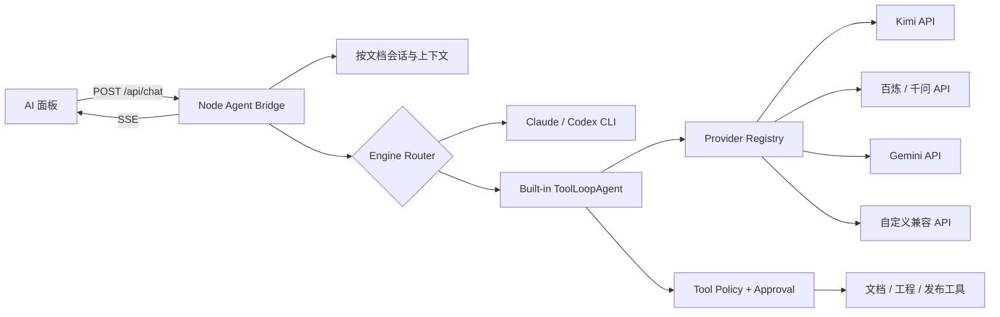

# 墨笺 Markdown 内置 Agent 技术方案

> 状态：实施中（`codex/builtin-agent`）  
> 推荐技术底座：Vercel AI SDK `ToolLoopAgent`

## 实施进度

已完成 Phase 0/Phase 1 与首个 Phase 2 当前文档写入闭环：

- 接入 AI SDK `ToolLoopAgent`、Google provider 与 OpenAI-compatible provider；
- 新增 Gemini、Kimi、通义千问、自定义兼容接口四种 API Agent 设置；
- 完成 API Key 掩码、模型、baseURL 与代理配置；
- 完成当前文档读取、工程文件读取、文件列表与文本搜索四个只读工具；
- 完成目录穿越、软链接逃逸、敏感文件和大文件防护；
- Bridge 支持 API Agent 的 SSE 文本、工具进度、按文档历史和 token 用量；
- 用本地 mock OpenAI-compatible 服务验证了流式 tool call 两步闭环；
- 新增绑定请求、工具和参数摘要的一次性审批票据；
- 当前文档替换会展示紧凑 diff，并在等待期间检查编辑器正文冲突；
- 写入使用版本指纹与同目录原子替换，应用后进入编辑器撤销历史并提供一键撤销；
- 保留原 Claude、Codex 与 Gemini 翻译路径。

尚未完成：真实 Kimi/千问及 Gemini 工具调用的 provider contract 验证、系统安全存储、用户取消、飞书/钉钉发布审批，以及上下文压缩。Gemini Key 的连接测试与设置保存已由实际桌面端验证。

## 1. 目标与非目标

### 目标

- 用户不安装 Codex/Claude CLI，也能使用具备 tool loop 的 Agent；
- 支持 Kimi、通义千问、Gemini 与自定义 OpenAI-compatible API；
- 复用现有 AI 面板、SSE、文档会话、工程上下文和确认交互；
- Agent 可安全读取当前文档；经确认后可修改文档或调用飞书/钉钉发布；
- 保留现有 Claude、Codex、Gemini 功能，渐进迁移。

### 非目标

- 首版不做多 Agent 编排；
- 不提供任意 Bash 或完整电脑控制；
- 不把 Mastra/LangGraph 作为新的应用框架；
- 不建设云端账户、代理转发或统一计费；API 请求默认由用户本机直连供应商；
- 本文档不授权实施。

## 2. 总体架构



核心边界：模型只能“提出工具调用”；服务端的 Policy 层决定该工具是否可见、参数是否合法、是否已获授权，最终执行权不交给模型。

## 3. 模块设计

建议按现有 feature ownership 拆分，不扩大 `agent-bridge.js`：

| 模块 | 职责 |
| --- | --- |
| `scripts/agent-bridge-builtin-agent.js` | 创建和运行 `ToolLoopAgent`，映射流式事件、停止条件、取消与错误 |
| `scripts/agent-bridge-providers.js` | provider registry；Kimi、千问、Gemini、自定义兼容接口；能力白名单 |
| `scripts/agent-bridge-tools.js` | 工具 schema 和执行器；只暴露结构化、最小权限工具 |
| `scripts/agent-bridge-tool-policy.js` | 工具可见性、路径校验、审批票据、请求级权限与审计摘要 |
| `scripts/agent-bridge-settings.js` | 扩展 provider 设置；密钥读取/更新仍只发生在 bridge 侧 |
| `scripts/agent-bridge-store.js` | 扩展内置 Agent 的消息历史、摘要和兼容性探测结果 |
| `src/editor/aiSettingsMethods.ts` | provider、区域、模型、baseURL、测试连接 UI |
| `src/editor/aiMethods.ts` | 复用现有 SSE；增加工具审批和停止运行事件，避免加入 provider 业务逻辑 |

## 4. Provider 抽象

统一配置模型：

```ts
type ProviderConfig = {
  id: string;
  kind: 'google' | 'openai-compatible';
  label: string;
  apiKeyRef: string;
  baseURL?: string;
  modelId: string;
  region?: 'cn' | 'intl' | 'custom';
  agentCapability: 'verified' | 'unknown' | 'unsupported';
};
```

设计原则：

- API Key 本体与普通 settings 分离，配置只保存引用；
- 官方 provider 使用官方 SDK adapter；
- Kimi、千问和自定义渠道通过 `createOpenAICompatible` 创建；
- `baseURL` 与 `modelId` 数据驱动，不散落在 engine 的条件分支里；
- 用户可修改 endpoint，但不得把密钥透传给工具或日志；
- 每个 provider 独立设置超时、重试与错误翻译，不用一个失败渠道拖垮其他渠道。

## 5. Agent loop

首版使用一个 `ToolLoopAgent`，建议约束：

- 最大 8 个 tool steps；
- 整轮 2 分钟超时；
- 支持用户 Abort；
- 默认只启用只读工具；
- 写入或外发工具必须有本次请求的 approval ticket；
- 工具结果限制大小，超长文件先切片或摘要；
- 每一步输出安全的状态标签，不向 UI 暴露模型隐藏推理。

停止条件包括：模型给出最终回答、达到步数上限、用户取消、超时、费用预算达到上限、工具策略拒绝。任何停止都要生成可理解的 UI 状态，不能只返回 provider 原始错误。

## 6. 首版工具集

不提供 shell。首版只需要以下结构化工具：

| 工具 | 默认权限 | 约束 |
| --- | --- | --- |
| `read_current_document` | 允许 | 只读当前 scratch 文档，可按行/字符分页 |
| `read_project_file` | 允许 | 路径必须位于工程根或明确授权目录；拒绝软链接逃逸 |
| `list_project_files` | 允许 | 限数量、忽略敏感目录与大文件 |
| `search_project_text` | 允许 | 限工程根、结果数和输出长度 |
| `replace_current_document` | 每次确认 | 只能写当前 scratch 文件，由现有同步逻辑回写 |
| `publish_to_feishu` | 每次确认 | 复用确定性的 connector，不让模型拼 CLI 参数 |
| `publish_to_dingtalk` | 每次确认 | 同上，返回结构化 URL 与标题 |

“发布到飞书/钉钉”继续保留现有一键确定性路径。Agent 工具只调用同一 connector 函数，不能复制一套实现。

## 7. 审批与安全

当前 UI 主要在请求开始前判断是否允许项目工具。内置 Agent 建议升级为两层：

1. **请求级授权**：是否允许读取工程、修改当前文档、对外发布；
2. **执行级确认**：模型真的准备执行写入/发布时，UI 展示目标、摘要与影响范围，用户确认后签发一次性 approval ticket。

ticket 应绑定 `requestId + toolName + normalizedArgsHash`，单次使用、短时有效，避免确认 A 操作后被复用于 B 操作。

路径校验必须使用规范化后的真实路径，并同时拒绝 `..`、工程外绝对路径与通过 symlink 逃逸。读取时默认屏蔽 `.env`、凭据目录、私钥、浏览器配置和 Agent 会话私有文件。

## 8. 会话与上下文

内置 Agent 不依赖供应商 session id。按 `documentId + engine/provider` 存储标准化消息历史：

- 首轮放入当前文档和选区上下文；
- 后续按需通过工具读取最新 scratch 文档，避免每轮重复整篇；
- 保留用户消息、最终回答、工具调用及工具结果摘要；
- 达到上下文阈值时生成滚动摘要；
- 文档内容变化后记录版本指纹，防止 Agent 基于旧正文写回；
- 切换 provider 时可复用标准消息，但要丢弃 provider 私有 metadata。

## 9. SSE 事件契约

继续沿用现有 `/api/chat`，新增或标准化以下事件：

- `meta`：provider、model、projectRoot、resumed；
- `delta`：最终回答文本增量；
- `progress`：安全的步骤状态；
- `tool-call`：工具名和可公开参数摘要；
- `approval-required`：确认内容与 approval id；
- `tool-result`：成功/失败及安全摘要；
- `document-update`：沿用现有回写；
- `usage`：输入/输出 token 和可获取时的费用；
- `done` / `error` / `cancelled`。

模型 reasoning 内容不进入 SSE，工具原始返回值先经过脱敏和长度限制。

## 10. 设置界面

AI 设置建议从“引擎列表”演进成两个分组：

- **本地 Agent**：Claude Code、Codex；显示 CLI 安装与登录状态；
- **API Agent**：Kimi、通义千问、Gemini、自定义兼容接口；显示 API Key、区域、模型、连接测试与 Agent 能力状态。

连接测试分两级：

1. Chat 测试：验证身份、endpoint、模型和普通流式文本；
2. Agent 测试：让模型调用一个本地无副作用的 `echo_probe` 工具，验证 tool call 的流式与 JSON 参数。

只有第二级通过后才显示“Agent 可用”。

## 11. 分期计划

### Phase 0：技术 spike

- 在独立测试脚本中接入 AI SDK；
- 对 Kimi、千问、Gemini 各选一个支持工具调用的模型；
- 验证文本流、串行 tool call、中文参数、取消、错误和代理；
- 记录依赖安装体积和打包结果；
- 不接 UI、不改用户数据。

通过标准：三家至少各有一个模型完成“读取模拟文档 → 调用无副作用工具 → 中文回答”的完整 loop。

### Phase 1：最小内置 Agent

- provider registry；
- 只读工具；
- 复用现有聊天 UI 和 SSE；
- 按文档会话；
- 停止、超时、步数与 token 用量；
- API Key 安全存储。

### Phase 2：受控写入与发布

- 一次性审批 ticket；
- 当前文档写回与版本冲突检测；
- 飞书/钉钉结构化发布工具；
- 工具轨迹和失败重试体验。

### Phase 3：产品化

- 模型能力清单与自动探测缓存；
- 上下文压缩；
- provider 导入/导出时排除密钥；
- 兼容性回归矩阵、用量提示和诊断页；
- 再决定是否需要 MCP、Mastra 或 LangGraph。

## 12. 测试策略

遵循项目现有两层测试与 test-first 规则：

- Unit：provider 配置规范化、能力判断、停止条件、事件映射、路径策略、approval ticket、消息压缩；
- Bridge unit：用本地 mock OpenAI-compatible SSE 服务跑完整 tool loop，不访问真实 API；
- E2E：配置渠道、发起对话、工具确认/拒绝、取消、文档写回、错误恢复；
- Provider contract：显式 opt-in 的真实 API 测试，不进入普通 CI；
- Desktop smoke：验证打包后 Node/Electron 环境、代理和安全存储可用。

每个行为变更先写失败测试；实现完成后运行 `npm run check`，用户可见流程再运行 `npm run test:e2e`。

## 13. 决策门槛

在进入正式实现前，需要确认四项：

1. 首发 provider 是否确定为 Kimi、千问、Gemini；
2. API Key 是否只支持用户自带（BYOK），不做平台代付；
3. 首版是否只读，写文档和发布延后到 Phase 2；
4. 桌面端是否为首发载体——若同时支持纯 Web，必须额外设计本地 bridge 安装、CORS 与密钥边界。

在这四项明确后，建议先做 Phase 0 spike，再依据真实模型兼容性决定实现排期，而不是直接进入完整 UI 开发。
